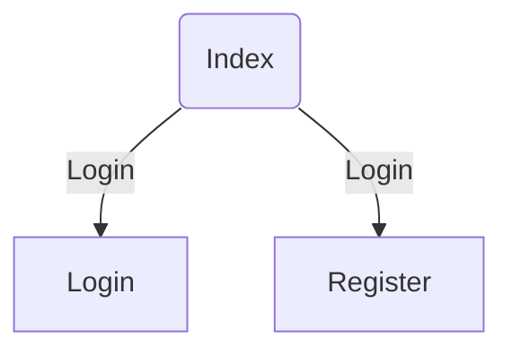
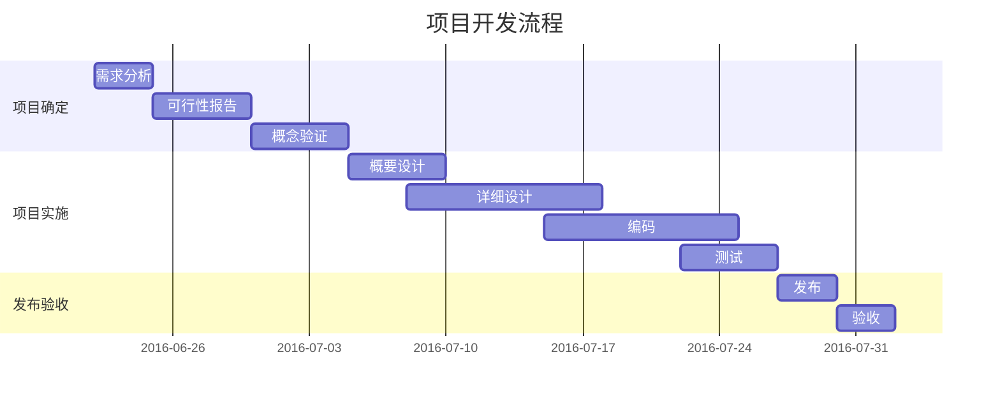
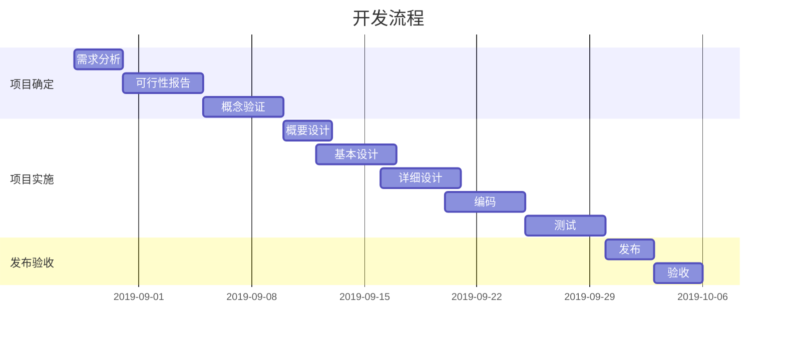

# Django

```mermaid
graph TB;
    id1(Index)--Login-->id2[Login];
    id1(Index)--Login-->id3[Register];
```

```mermaid
gantt
    title 项目开发流程
    section 项目确定
        需求分析       :a1, 2016-06-22, 3d
        可行性报告     :after a1, 5d
        概念验证       : 5d
    section 项目实施
        概要设计      :2016-07-05, 5d
        详细设计      :2016-07-08, 10d
        编码          :2016-07-15, 10d
        测试          :2016-07-22, 5d
    section 发布验收
        发布: 3d
        验收: 3d
```

```mermaid
gantt
    title 开发流程
    section 项目确定
        需求分析    :a1, 2019-08-28, 3d
        可行性报告  :after a1, 5d
        概念验证    :5d
    section 项目实施
        概要设计    :2019-09-10, 3d
        基本设计    :2019-09-12, 5d
        详细设计    :2019-09-16, 5d
        编码        :2019-09-20, 5d
        测试        :2019-09-25, 5d
    section 发布验收
        发布:3d
        验收:3d
```
