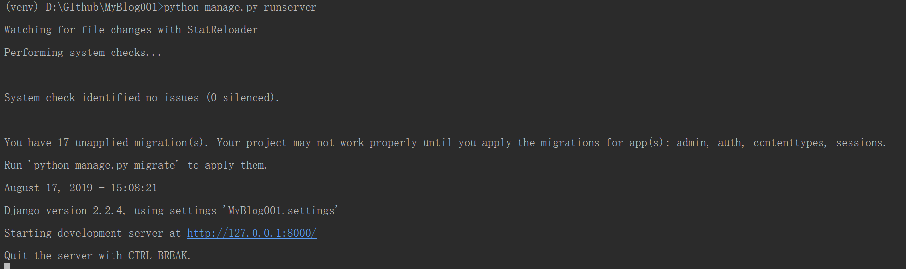

# My first Dajango App

## Start Pycharm

## Create Django project

> Create Project

- File > New Project > Django > Create

> Create app

- Alt+F12 goto terminal
- python manage.py startapp blog

> Change setting.py

```python
INSTALLED_APPS = [
    'django.contrib.admin',
    'django.contrib.auth',
    'django.contrib.contenttypes',
    'django.contrib.sessions',
    'django.contrib.messages',
    'django.contrib.staticfiles',
    'blog',  # 这里直接写app的名字就好，写mysite.blog会报错
]
```

## views.py

```python
from django.http import HttpResponse

def index(request):
    return HttpResponse('Hello')
```

## urls.py

```python
from django.contrib import admin
from django.urls import path
from blog import views

urlpatterns = [
    path('admin/', admin.site.urls),
    path('index/', views.index),
]
```

## Start Server

> python manage.py runserver
---
> python manage.py runserver 0.0.0.0:8000
> setting.py



```python
ALLOWED_HOSTS = ['*']
```
