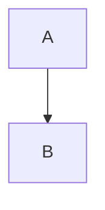
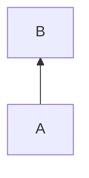
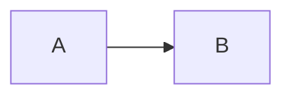
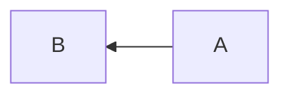
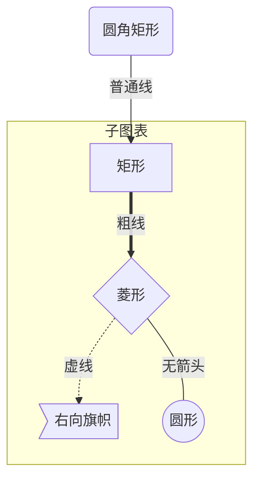
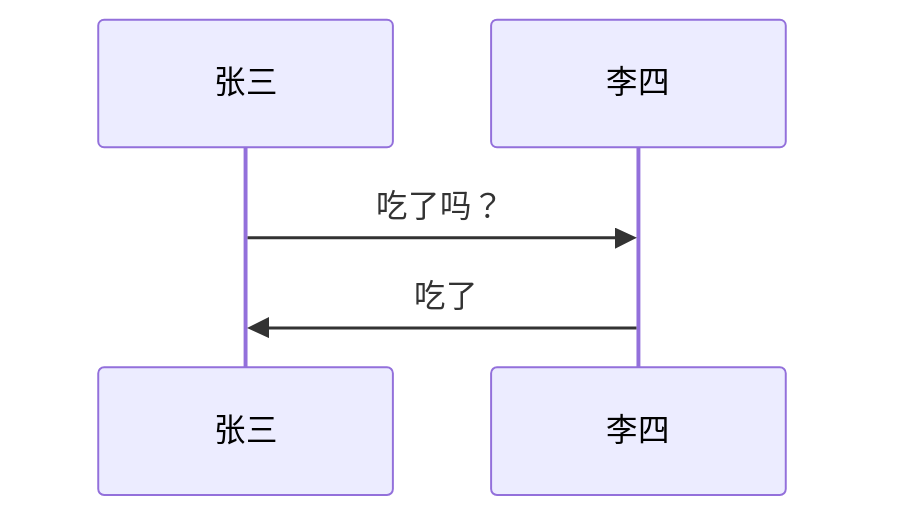
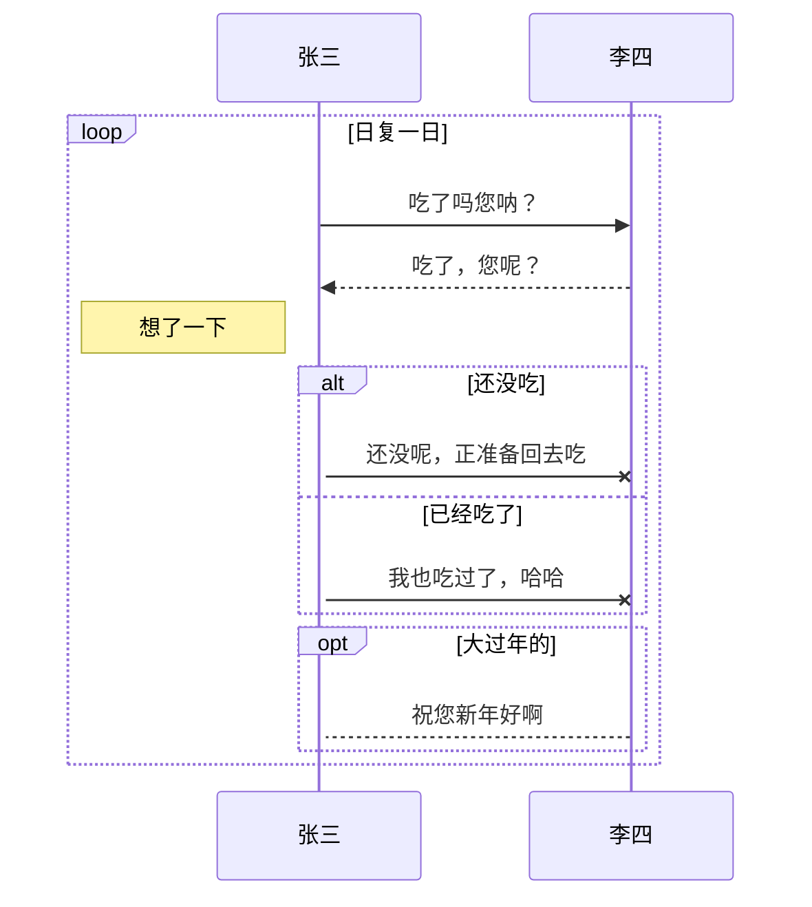
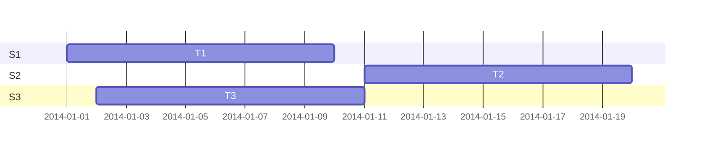
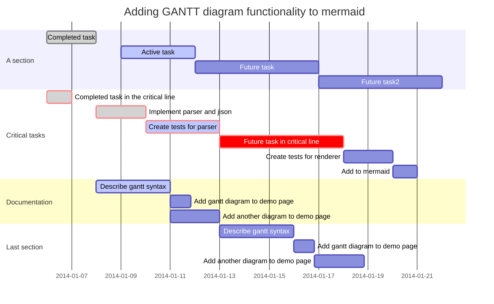

# markdown

## 流程图

### 图标方向

Mermaid 支持多种图表的方向，语法如下：

```marldown
graph 方向描述
    图表中的其他语句...
```

其中“方向描述”为

用词 | 含义
-----|-----
TB   | 从上到下
BT   | 从下到上
RL   | 从右到左
LR   | 从左到右

**从上到下**



**从下到上**



**从左到右**



**从右到左**



### 节点定义

即流程图中每个文本块，包括开始、结束、处理、判断等。Mermaid 中每个节点都有一个 id，以及节点的文字。

表述       | 说明
---------|--------
id[文字]   | 矩形节点
id(文字)   | 圆角矩形节点
id((文字)) | 圆形节点
id>文字]   | 右向旗帜状节点
id{文字}   | 菱形节点

<font color=red>需要注意的是，如果节点的文字中包含标点符号，需要时用双引号包裹起来。</font>

### 节点间的连线

表述     | 说明
---------|--------
>        | 添加尾部箭头
-        | 不添加尾部箭头
–        | 单线
–text–   | 单线上加文字
==       | 粗线
==text== | 粗线加文字
-.-      | 虚线
-.text.- | 虚线加文字

### 子图表

使用以下语法添加子图表

```markdown
subgraph 子图表名称
    子图表中的描述语句...
end
```

### 对 fontawesome 的支持

使用 fa: #图表名称# 的语法添加 fontawesome。

举个例子:



## 序列图

使用以下语法开始序列图

```markdown
sequenceDiagram
    [参与者1][消息线][参与者2]:消息体
    ...
```



参与者
上例中的张三、李四都是参与者，上例中的语法是最简单的，也可以明显表明参与者有哪些:

```markdown
sequenceDiagram
    participant 参与者 1
    participant 参与者 2
    ...
    participant 简称 as 参与者 3 #该语法可以在接下来的描述中使用简称来代替参与者 3
```

### 消息线

类型 | 描述
-----|--------------
->   | 无箭头的实线
–>   | 无箭头的虚线
->>  | 有箭头的实线
–>>  | 有箭头的虚线
-x   | 末端为叉的实线（表示异步）
–x   | 末端为叉的虚线（表示异步）

### 处理中

在消息线末尾增加 + ，则消息接收者进入当前消息的“处理中”状态；
在消息线末尾增加 - ，则消息接收者离开当前消息的“处理中”状态。
或者使用以下语法直接说明某个参与者进入“处理中”状态:
> activate 参与者

### 标注

语法如下

> Note 位置表述 参与者: 标注文字

其中位置表述可以为

表述     | 含义
---------|--------------
right of | 右侧
left of  | 左侧
over     | 在当中，可以横跨多个参与者

### 循环

语法如下

```markdown
loop 循环的条件
    循环体描述语句
end
```

### 判断

```markdown
alt 条件 1 描述
    分支 1 描述语句
else 条件 2 描述 # else 分支可选
    分支 2 描述语句
else ...
    ...
end
```
如果遇到可选的情况，即没有 else 分支的情况，使用如下语法：

```markdown
opt 条件描述
    分支描述语句
end
```



## 甘特图(gantt)

甘特图是一类条形图，由Karol Adamiechi在1896年提出, 而在1910年Henry Gantt也独立的提出了此种图形表示。通常用在对项目终端元素和总结元素的开始及完成时间进行的描述。

示例：





标记       | 简介
-----------|----------
title      | 标题
dateFormat | 日期格式
section    | 模块
Completed  | 已经完成
Active     | 当前正在进行
Future     | 后续待处理
crit       | 关键阶段
日期缺失   | 默认从上一项完成后

关于日期的格式可以参考：

[http://momentjs.com/docs/#/parsing/string-format/](http://momentjs.com/docs/#/parsing/string-format/)

[https://github.com/mbostock/d3/wiki/Time-Formatting](https://github.com/mbostock/d3/wiki/Time-Formatting)


```markdown

```

```mermaid
sequenceDiagram
```
